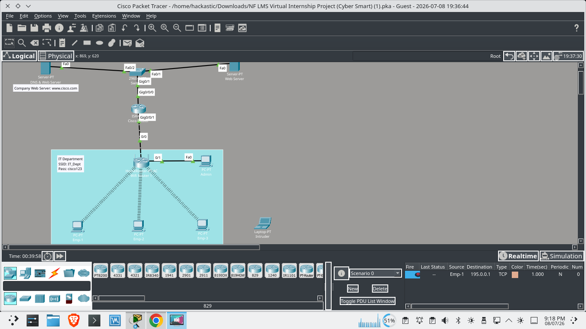
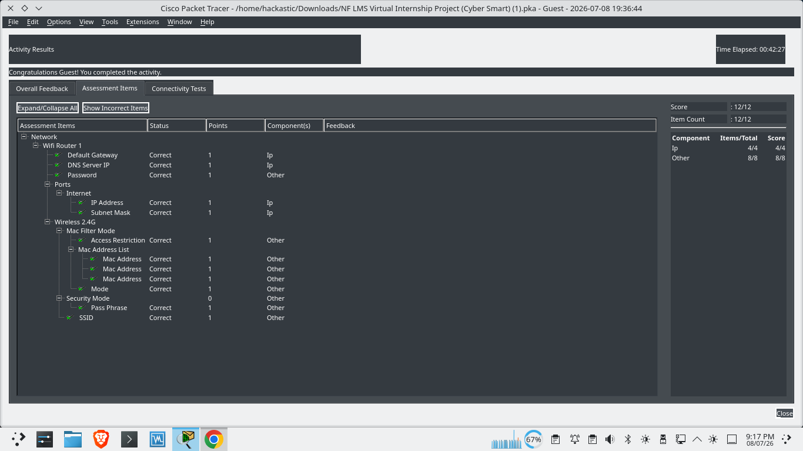

# 🔐 Cyber Smart Network Security

A **Cisco Packet Tracer** project demonstrating secure wireless network configuration using **WPA2 Security, MAC Address Filtering, DNS, and Router/Switch configuration**.

---

## 📖 Overview

This project was developed as part of the **Cyber Smart Virtual Internship**. It focuses on building a secure wireless office network where only authorized devices can connect while ensuring proper network communication and access control.

---

## 🚀 Features

- 🔒 WPA2 Wireless Security
- 📡 MAC Address Filtering
- 🌐 DNS & Default Gateway Configuration
- 🖧 Router & Switch Configuration
- 💻 Authorized Device Access
- ✅ Network Connectivity Verification

---

## 🛠️ Technologies

- Cisco Packet Tracer
- IPv4 Networking
- Wireless LAN (WLAN)
- DNS
- Router & Switch Configuration
- Network Security Fundamentals

---

## 📸 Project Screenshots

### 🖥️ Network Topology



### ✅ Assessment Result (12/12)



---

## 📂 Project Structure

```text
Cyber-Smart-Network-Security/
│── Cyber Smart Virtual Internship Project.pka
│── README.md
└── assets/
    ├── network-configuration.png
    └── assessment-result.png
```

---

## 🎯 Learning Outcomes

- Secure Wireless Network Configuration
- MAC Address Filtering
- WPA2 Authentication
- DNS & Gateway Configuration
- Basic Network Security
- Cisco Packet Tracer Simulation

---

## 👨‍💻 Author

**Anubhav**  
Cybersecurity Enthusiast | BCA (Hons.) Student

---

## 📜 Disclaimer

This project was created for **educational purposes only** using Cisco Packet Tracer in a simulated environment.
